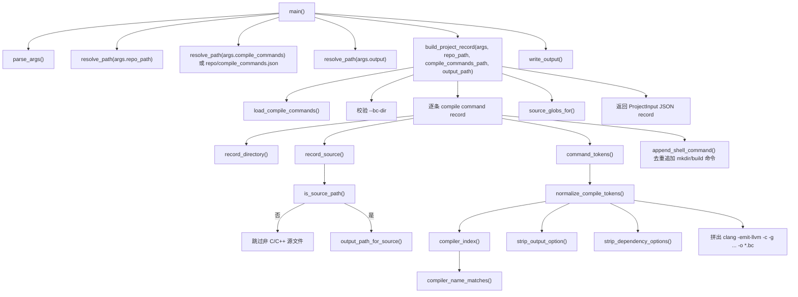
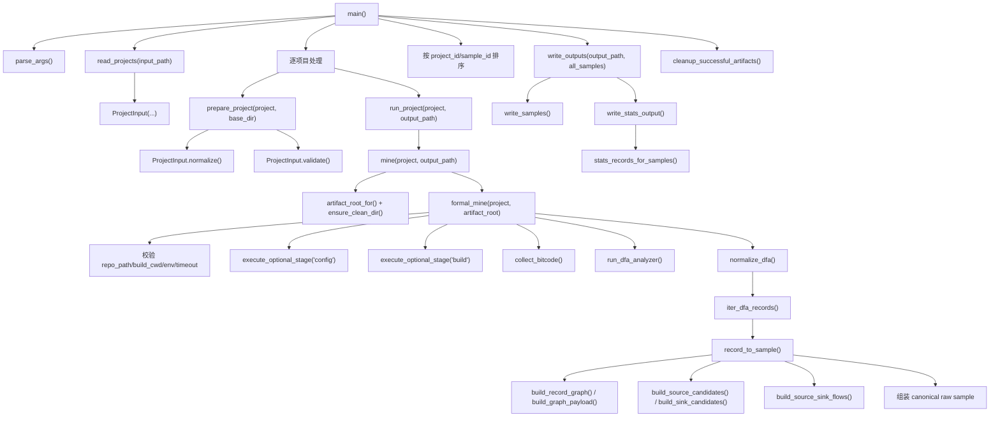
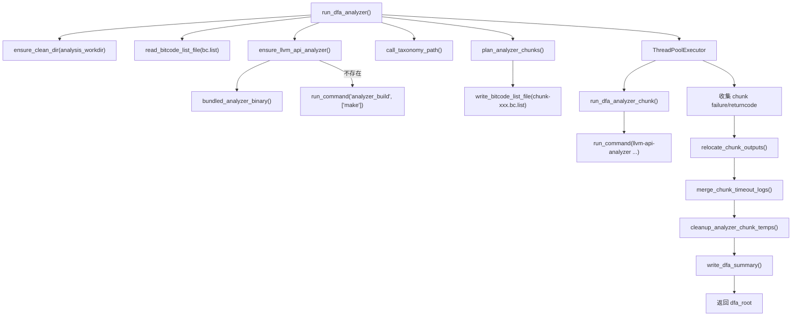
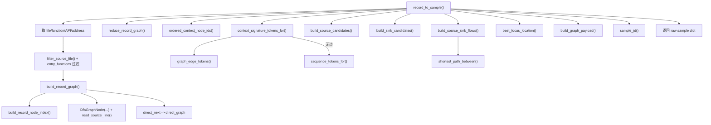
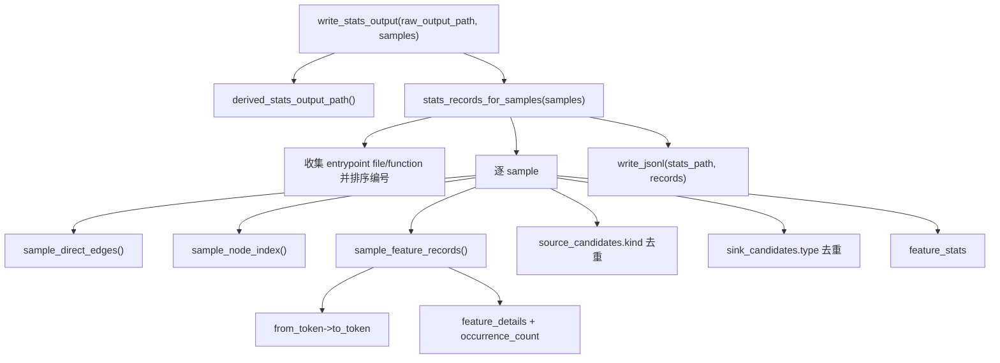

# Stage A 详细分析

本文档描述当前仓库中 Stage A 的真实实现。Stage A 的职责是对 C/C++ 项目做基于 LLVM IR 的 API 级静态分析，围绕每一个可解析的调用点恢复一个 seed-centric 的相关 API/check 子图，并输出后续 Stage B/Stage C 使用的数据视图。

相关实现文件：

- `a/cmd/miner.py`：Stage A 主入口，负责输入校验、构建命令、bitcode 收集、analyzer 并行调度、DFA 记录归一化、`raw/stats` 输出。
- `a/cmd/gen_input.py`：Stage A 输入生成器，从 `compile_commands.json` 改写出能生成 LLVM bitcode 的 `projects.in.jsonl`。
- `a/analyzer/llvm_api_analyzer.cpp`：LLVM IR analyzer，负责真正的数据流/控制流分析，产出低层 DFA JSON 记录。
- `a/config/call_taxonomy.json`：call taxonomy 规则，供 C++ analyzer 给调用打 `sink_kind`。
- `a/cmd/llm_export.py`：Stage A LLM 证据导出器，从 `samples.raw.jsonl` 和项目源码恢复 Stage C 使用的 `samples.llm.jsonl` 证据。
- `pipeline.py`、`Makefile`、`a/Makefile`：根管线和 Stage A 便捷命令。

## 1. Stage A 产物

Stage A 当前有三个主要产物。

### 1.1 `samples.raw.jsonl`

这是 Stage A 的 canonical 原始样本视图，由 `a/cmd/miner.py --output` 指定。每一行是一条围绕某个 seed API 调用恢复出的上下文样本。

核心内容包括：

- `project_id`：项目 ID。
- `sample_id`：稳定样本 ID，当前用 SHA1 从 `project_id + entrypoint_id + seed_api + seed_address + context_signature_tokens` 派生。
- `entrypoint`：seed 所在函数位置，包含 `file/function/line/id`。
- `seed`：当前样本的 root 调用点，包含 API 名、IR 派生地址、参数标签、源码位置、token、源码切片。
- `graph`：相关 API/check 子图，包含 `nodes/direct_edges/roots/leaves/checks`。
- `source_candidates`：根据 API 名识别出的外部输入来源，如 `stdin/network/filesystem/environment/argv`。
- `sink_candidates`：根据 call taxonomy 打出的 `sink_kind` 标签识别出的敏感 API 调用。
- `source_sink_flows`：source 到 sink 的最短候选路径，最多保留 3 条。
- `evidence_slice`：由相关节点源码行拼接出的可读证据片段。
- `context_signature_tokens`：样本结构签名，优先使用图边 token。
- `analysis_warnings`、`analyzer_stats`、`indirect_call_stats`：analyzer 的告警和统计。
- `focus`：下游审计优先关注的位置；有 sink 时取最早 sink，否则取 seed。

### 1.2 `samples.stats.jsonl`

这是 Stage B 的输入视图，由 `miner.py` 在写 raw 后自动派生。路径要求 raw 输出名以 `.raw.jsonl` 结尾，然后替换为 `.stats.jsonl`。

schema 固定为：

```text
stagea.stats.features.v1
```

每条 stats 记录从 raw 样本的 `graph.direct_edges` 抽取特征：

- `feature_tokens`：边 token 集合，例如 `call:fgets->check:CHECK`。
- `feature_details`：每个边特征的节点 ID、调用名、源码位置、参数标签和出现次数。
- `location_id/location`：按 entrypoint 文件和函数分配的稳定位置编号。
- `seed_token`、`source_kinds`、`sink_types`、`focus`、`feature_stats`。

Stage B 不直接消费 raw，而是消费这个 stats 视图。

### 1.3 `samples.llm.jsonl`

这是 Stage A 的 LLM 证据视图，由 `a/cmd/llm_export.py` 从 raw 输出导出。根目录 `make run-a` 和 `make run-abcd` 都会产生它。

它用于 Stage C，重点保留 LLM 审计需要的信息：

- seed、focus、entrypoint。
- `representative_traces`：最多 3 条 source-sink 候选路径。
- `graph_excerpt`：压缩后的局部图。
- `code_slices`：seed/focus/source/sink/guard 周围源码窗口。
- `internal_function_summaries`：相关内部函数摘要、调用列表、检查语句和函数片段。

## 2. 输入契约

Stage A 主入口：

```bash
python3 a/cmd/miner.py --input a/input/xxx.in.jsonl --output a/out/samples.raw.jsonl
```

输入文件是 JSONL，每行一个项目记录。当前实现只支持 C/C++。

示例结构：

```json
{
  "project_id": "juliet_small_c",
  "repo_path": "juliet-small",
  "language": "c",
  "framework": "juliet",
  "default_branch": "",
  "extensions": {
    "analysis_backend": "llvm_api_dfa",
    "build_cmd": "mkdir -p bc && clang -emit-llvm -c -g -O0 -o bc/foo.bc foo.c",
    "analyzer_jobs": 2,
    "analysis_timeout": 300,
    "bitcode_globs": ["bc/*.bc"],
    "source_globs": ["**/*.c"]
  }
}
```

### 2.1 顶层字段

- `project_id`：必填，输出和 artifact 目录使用它分组。
- `repo_path`：必填，项目源码目录。相对路径会按输入 JSONL 所在目录解析。
- `language`：必填，支持 `c`、`cpp`、`c++`、`cc`、`cxx`。
- `framework`：必填，会被小写化，原样进入输出。
- `default_branch`：当前不参与核心分析。
- `extensions`：Stage A 的构建和过滤配置。

### 2.2 `extensions` 字段

- `analysis_backend`：可选；为空时默认 `llvm_api_dfa`。当前只接受 `llvm_api_dfa`，其他值直接报错。
- `build_cmd`：必填；shell 字符串。Stage A 不自己猜测构建方式，必须由输入显式提供能生成 LLVM bitcode 的命令。
- `config_cmd`：可选；在 `build_cmd` 前执行，适合 configure/cmake 之类准备步骤。
- `build_env`：可选对象；合并进子进程环境。
- `build_cwd`：可选；构建工作目录。默认是 `repo_path`。相对路径按 `repo_path` 解析。
- `analysis_timeout`：可选正整数，默认 900 秒。用于 config/build/analyzer 子命令超时。
- `analyzer_jobs`：必填整数，且必须大于 1。当前 analyzer 必走 chunked parallel 执行。
- `target_subdirs`：可选字符串列表。若提供，只保留这些目录前缀下的源码记录。
- `entry_functions`：可选字符串列表。若提供，只保留函数名精确匹配的记录。
- `source_globs`：可选字符串列表。若未设置 `target_subdirs`，用于过滤源码路径。还会通过环境变量 `STAGE_A_SOURCE_GLOBS_JSON` 传给构建环境。
- `bitcode_globs`：可选字符串列表。默认 `["**/*.bc"]`。必须匹配非空 `.bc` 文件集合。

### 2.3 输入生成器

`a/cmd/gen_input.py` 是显式输入适配层。它不扫描源码猜测构建参数，
而是读取真实构建系统产生的 `compile_commands.json`，把其中每条
`gcc/g++/clang/clang++` 风格编译命令改写为 LLVM bitcode 编译命令，
再写出 Stage A 消费的 `projects.in.jsonl`。

默认根命令：

```bash
python3 pipeline.py gen-input \
  --repo-path ./srcs \
  --compile-commands ./srcs/compile_commands.json \
  --output ./a/input/srcs.in.jsonl
```

生成器契约：

- `repo_path` 必须是已有目录。
- `compile_commands.json` 必须存在且是 JSON array。
- 只接受其中的 C/C++ 源文件记录：`.c/.cc/.cpp/.cxx`。
- 每条命令保留原有 include、define、标准、架构等参数，移除原 `-o`、
  `-c/-S/-E` 以及依赖文件生成参数 `-M/-MM/-MD/-MMD/-MF/-MT/-MQ/-MJ/-MP/-MG`，
  并加上 `-emit-llvm -c -g`。
- `.c` 使用 `--clang`，C++ 使用 `--clangxx`。
- 编译器识别支持 `gcc/g++/clang/clang++/cc/c++`、`*-gcc/*-g++/*-clang/*-clang++`
  以及 `ccache/sccache/distcc` 这类包装器后的真实编译器。
- 同一个源文件若在 `compile_commands.json` 中出现多次，会保留第一条的常规
  `<source>.bc` 输出；后续编译变体会加 `variant<N>-<hash>` 后缀，避免互相覆盖。
- bitcode 默认写到 `repo_path/bc/**.bc`，Stage A 输入中的 `bitcode_globs` 为 `bc/**/*.bc`。
- 输出文件已存在时默认失败；需要覆盖必须显式传 `--force`。
- 没有 `compile_commands.json` 或没有可用 C/C++ 编译记录时直接失败，不退回裸扫 `.c/.cpp`。

`compile_commands.json` 的来源由项目决定。例如 CMake 项目可用
`-DCMAKE_EXPORT_COMPILE_COMMANDS=ON`，Makefile 项目可用 `bear -- make`
捕获真实编译命令。Juliet 这类独立测试集合若没有构建系统，应先用专门脚本
显式生成 `compile_commands.json`，再交给 `gen-input`。

## 3. 顶层运行流程

Stage A 的主流程在 `miner.py` 的 `main()`、`formal_mine()` 和 `run_dfa_analyzer()` 中实现。

整体流程：

```text
读取 projects.in.jsonl
  -> 逐项目 normalize/validate
  -> 清理并创建 artifact root
  -> 执行 config_cmd
  -> 执行 build_cmd，生成 .bc
  -> 收集并校验 .bc
  -> 构建或发现 llvm-api-analyzer
  -> 拆分 bc.list 为多个 chunk
  -> 并行运行 C++ analyzer
  -> 合并 analyzer 输出
  -> 回放 DFA JSON 记录并归一化为 raw samples
  -> 聚合所有项目样本
  -> 写 samples.raw.jsonl
  -> 派生并写 samples.stats.jsonl
  -> 删除成功项目的 artifact root
```

### 3.1 项目读取与校验

`read_projects()` 逐行读取 JSONL，创建 `ProjectInput`。随后 `prepare_project()` 做两步：

1. `normalize(base_dir)`：
   - `framework/language` 小写化。
   - 相对 `repo_path` 解析为绝对路径。

2. `validate()`：
   - 校验 `project_id/repo_path/framework/language` 非空。
   - 校验语言属于 C/C++。
   - 校验 `build_cmd` 存在。
   - 校验 backend 只能是 `llvm_api_dfa`。
   - 校验 `analyzer_jobs > 1`。

不合法项目会打印 `skip invalid project ...` 并跳过，不会中断整个 JSONL 文件中其他项目。

### 3.2 artifact 目录

每个项目的 artifact 根目录为：

```text
<raw_output_dir>/a.artifacts/<project_id>/
```

每次运行该项目前会清空这个目录。主要文件包括：

- `run_manifest.json`：命令、analyzer、chunk、失败信息和时间。
- `bitcode_manifest.json`：bitcode 收集结果和格式识别。
- `bc.list`：复制后的 bitcode 绝对路径列表。
- `dfa_summary.json`：analyzer 输出摘要。
- `failures.json`：失败时的结构化失败记录。
- `analysis_workdir/`：analyzer 临时工作区和 DFA 输出。

成功项目的 artifact 只用于生成本轮 raw/stats。`samples.raw.jsonl` 和
`samples.stats.jsonl` 都写成功后，`miner.py` 会删除这些成功项目的
`a.artifacts/<project_id>/`，避免长期保留 bitcode 副本和 DFA 临时输出。
失败项目的 artifact 会保留，用于查看 `run_manifest.json` 和 `failures.json`
等诊断信息。

### 3.3 构建阶段

`formal_mine()` 先检查：

- `repo_path` 必须存在且是目录。
- `build_cwd` 必须存在且是目录。

然后构造运行环境：

- 从当前 `os.environ` 复制。
- 合并 `extensions.build_env`。
- 如果配置了 `source_globs` 且环境中没有 `STAGE_A_SOURCE_GLOBS_JSON`，则写入 JSON 字符串形式的 source globs。

命令执行顺序：

1. `config_cmd`，可选。
2. `build_cmd`，必选。

命令通过 `/bin/bash` 执行，因为输入要求是 shell 字符串。stdout/stderr 的尾部会写入 `run_manifest.json`，便于失败诊断。返回码非 0、超时、命令不存在都会变成 `ProjectFailure`。

### 3.4 bitcode 收集

`collect_bitcode()` 在 `repo_path` 下按 `bitcode_globs` 搜索 `.bc` 文件。

处理规则：

1. 对每个 glob 匹配文件，只接受普通文件且后缀是 `.bc`。
2. 以相对 `repo_path` 的路径为 key 去重。
3. 复制到 artifact 目录：

```text
a.artifacts/<project_id>/bcfs/<project_id>/<relative-path>
```

4. 对复制后的文件读取 magic header 做格式识别：
   - `BC c0 de`：`llvm_bitcode`
   - `de c0 17 0b`：`llvm_bitcode_wrapper`
   - `7f 45 4c 46`：`elf_object`
   - 文本 IR 头：`llvm_ir_text`
   - 其他：`unknown`

当前只接受 `llvm_bitcode` 和 `llvm_bitcode_wrapper`。如果发现 ELF、文本 IR 或 unknown，会把 manifest 标为 invalid 并失败。

5. 写 `bc.list`，每行一个复制后 bitcode 的绝对路径。

这里的设计点是：analyzer 不直接读 repo 原始位置下的 `.bc`，而是读 artifact 里的稳定副本。这样失败复现时可以只看 artifact。

### 3.5 analyzer 二进制发现与构建

`ensure_llvm_api_analyzer()` 首先查找：

```text
a/analyzer/llvm-api-analyzer
```

如果存在且可执行，直接使用。否则在 `a/analyzer` 下执行 `make` 构建。

`a/analyzer/Makefile` 使用：

- `llvm-config`：优先 `/usr/lib/llvm-*/bin/llvm-config`，否则 PATH。
- C++ 编译器：优先 `/usr/lib/llvm-*/bin/clang++`，否则 `clang++`/`g++`。
- C++ 标准：`-std=c++17`。
- LLVM libs：`core irreader bitreader analysis support`。

### 3.6 analyzer chunk 并行

`run_dfa_analyzer()` 会读取 `bc.list`，按 `analyzer_jobs` 切分为若干 chunk。

切分算法：

```text
chunk_count = min(requested_jobs, bitcode_count)
base_size, extra = divmod(bitcode_count, chunk_count)

for chunk_index in 0..chunk_count-1:
    size = base_size + 1 if chunk_index < extra else base_size
    module_indices = [start, start + size)
    写 chunk-xxx.bc.list
```

每个 chunk 独立调用：

```bash
llvm-api-analyzer \
  --project-id <project_id> \
  --repo-path <repo_path> \
  --output-root <chunk_output_root> \
  --bc-list <chunk_bc_list> \
  --call-taxonomy a/config/call_taxonomy.json
```

并行执行使用 Python `ThreadPoolExecutor(max_workers=len(chunks))`。每个 chunk 内部的 module index 从 0 开始，所以运行完成后 `relocate_chunk_outputs()` 会把 chunk 局部文件名映射回全局 bitcode index。

示例：

```text
原始 bc.list: [m0.bc, m1.bc, m2.bc]
jobs=2

chunk-000: local 0,1 -> global 0,1
chunk-001: local 0   -> global 2
```

合并时如果出现不能解析的输出文件名、重复目标文件或 chunk 命令失败，会显式失败。

## 4. LLVM analyzer 核心算法

C++ analyzer 是 Stage A 的核心。它对每个 LLVM module 做 seed-centric 静态数据流分析。

入口：

```text
main()
  -> load call taxonomy
  -> read bc.list
  -> for each bitcode module:
       parseIRFile()
       analyzeModule()
       writeModuleRecords()
```

### 4.1 输出分桶

analyzer 产出的低层 DFA 记录按 bucket 写入：

```text
<output-root>/<api-name>+<positive-parameter-count>/<module-index>
```

例如：

```text
atoi+1/0
system+1/2
```

`positive-parameter-count` 不包含 seed 调用自身的返回值标签 `0`，只统计大于 0 的参数标签。

### 4.2 call taxonomy 分类

`call_taxonomy.json` 中每个类别有：

- `kind`
- `exact`
- `prefix`
- `contains`

`classifyCallKind()` 的匹配顺序：

1. API 名小写化。
2. 遍历 categories。
3. exact 命中则返回该 `kind`。
4. prefix 命中则返回该 `kind`。
5. contains 命中则返回该 `kind`。
6. 全部未命中返回空字符串。

当前分类包括 command、process、permission、network、filesystem、device、dynamic、database、compression、crypto、ipc、synchronization、memory、resource、serialization 等。

### 4.3 module 扫描

`analyzeModule()` 分两轮处理 module。

第一轮：给每个函数内的每条 instruction 分配稳定顺序号。

```text
for function in module:
  if function not empty:
    order = 0
    for basic block:
      for instruction:
        orderByInst[&instruction] = order
        order += 1
```

这个 order 后续用于生成节点地址：

```text
<source-anchor>::<function-name>:<instruction-order>
```

第二轮：遍历所有 call 指令，把每个可解析调用点作为 root seed。

```text
for function in module:
  for instruction in function:
    if instruction is CallBase:
      targets = resolvePotentialCallees(call)
      if direct call with no callee: skip
      if indirect call unresolved: skip as root
      rootName = displayCallName(call, targets)
      analyzeRootCall(...)
```

注意：当前 Stage A 的 seed 不是只从 sink 开始，也不是只从 source 开始，而是“每个可解析的 call 都可成为 seed”。之后再在 seed 相关上下文里识别 source/sink/check。

### 4.4 调用目标解析

`resolvePotentialCallees()` 区分直接调用和间接调用。

直接调用：

- `call.getCalledFunction()` 成功。
- 跳过 LLVM intrinsic 和调试/lifetime/assume 等内建函数。
- 返回单个 callee。

间接调用：

- 设置 `isIndirect = true`。
- 调用 `collectResolvedCallees()` 对 `calledOperand` 做有限深度恢复。
- 恢复不到候选则 `unresolved = true`。

间接调用候选恢复支持：

- 函数指针 strip pointer casts。
- `GlobalAlias`。
- `ConstantExpr` operands。
- `SelectInst` true/false。
- `PHINode` incoming values。
- `LoadInst` pointer operand。
- `GetElementPtrInst` pointer operand。
- `GlobalVariable` initializer。
- `ConstantStruct`、`ConstantArray`、`ConstantVector` operands。

限制：

- 递归深度超过 5 停止。
- 单个 callsite 最多保留 8 个候选 callee，超过会记录 `indirect_call_candidate_cap_hit`。
- 如果间接调用解析不到候选，会记录 `indirect_call_unresolved`。

间接调用的显示名：

- 若只有一个候选，显示该函数名。
- 若有多个候选，显示 `INDIRECT_CALL`。

### 4.5 节点模型

analyzer 内部节点结构是 `APIPath`。一个节点代表：

- 一个相关 call，或
- 一个相关控制检查，统一命名为 `CHECK`。

节点字段：

- `name`：API 名或 `CHECK`。
- `address`：源码锚点 + 函数名 + instruction order。
- `parameter`：与该节点相关的 seed 参数标签集合。
- `file/line`：debug info 或函数位置恢复的源码位置。
- `sinkKind`：sink 分类。
- `callKind`：`direct` 或 `indirect`。
- `unresolvedIndirect`：是否未解析间接调用。
- `resolvedCallees`：解析出的 callee 名称列表。
- `checkKind`：`branch/switch/select/return_guard`。
- `conditionText`：控制条件的 LLVM operand 文本。
- `branchCount`：分支数量。
- `prev/next`：API/check 图边。

### 4.6 seed 参数标签

`analyzeRootCall()` 对每个 root call 初始化标签：

- 标签 `0`：代表 root call 本身，也可理解为返回值/调用结果相关。
- 标签 `1..N`：代表 root call 的第 1 到第 N 个实参。

初始化伪代码：

```text
rootNode.parameter += 0
frvSet[rootCall] += 0
trackedSet[rootCall] += 0

for arg_i in rootCall.args:
    parameter = i + 1
    rootNode.parameter += parameter
    trackedSet[rootCall] += parameter
    findForwardRelateVariable(arg_i, parameter)

findBackwardRelateVariable()
```

这个标签体系贯穿后续分析。一个相关 API 节点的 `parameter` 字段表示：它与 seed 的哪些参数或返回值相关。

### 4.7 FRV/BRV 相关值传播

C++ analyzer 维护三类 map：

- `frvSet`：Forward Related Variables，正向相关值集合。
- `brvSet`：Backward Related Variables，反向/闭包后的相关值集合。
- `trackedSet`：已追踪值，防止递归重复，也承载临时占位标签。

#### 4.7.1 正向传播 `findForwardRelateVariable`

正向传播的目标是：从 seed 的参数/返回值出发，找到 IR 中和它们数据相关的值。

支持的传播规则：

- `Argument`、`GlobalVariable`、`AllocaInst`：作为可追踪 base，加入 `frvSet`。
- `Constant`：默认停止；如果是 constant pointer 场景，可以加入。
- `ConstantExpr`：继续追踪第一个 operand。
- `CallBase`：call result 与参数都可继续传播。
- `SelectInst`：结果与 true/false value 都相关。
- `GetElementPtrInst`：结果与 pointer operand 相关。
- `PHINode`：结果与所有 incoming value 相关。
- `ICmpInst`：比较结果与左右操作数相关。
- `LoadInst`：load result 与 pointer operand 相关。
- `UnaryInstruction`：结果与 operand 相关。
- `BinaryOperator`：结果与所有 operands 相关。
- `StoreInst`：store 指令、value operand、pointer operand 都可相关；pointer operand 作为 constant pointer 场景追踪。

特殊标签 `-1` 是占位标签，用于判断一个新 value 是否能归入已有相关集合。若后续发现该 value 已在 `frvSet` 中有真实参数标签，就把占位追踪项替换为真实标签。

#### 4.7.2 反向传播 `findBackwardRelateVariable`

反向传播把 FRV 扩展到使用者，形成更完整的相关闭包。

核心规则：

```text
for each (value, tags) in frvSet:
    brvSet[value] += tags
    for user in value.users:
        if user is constant: skip
        if user is StoreInst and store.value == value:
            brvSet[store.pointer] += tags
        brvSet[user] += tags

for each (value, tags) in brvSet:
    frvSet[value] += tags

if frvSet changed:
    recurse until fixed point
```

因此 BRV 不是单次 user 扩展，而是递归到 fixed point。后续判断某条 call/check 是否相关，主要看它或它的控制 operand 是否能落入 BRV/FRV 闭包。

#### 4.7.3 相关性判断 `isRelateOperation`

判断一个 value 是否相关：

1. 如果 `rvSet` 中已有该 value，返回 true。
2. 否则以占位标签 `-1` 调用 `findForwardRelateVariable()`。
3. 清理占位追踪。
4. 再看该 value 是否进入 `rvSet`。

这个机制允许 analyzer 在遍历 CFG 时动态发现新的相关值，而不是只依赖 seed 初始化时的闭包。

### 4.8 控制检查节点

Stage A 不只记录 call，也记录和 seed 相关的控制判断。

`controlOperand()` 支持：

- `BranchInst`：条件分支，要求 successor 数量至少 2。
- `SwitchInst`：switch 条件，要求 successor 数量至少 2。
- `SelectInst`：select 条件。
- `ReturnInst`：返回值，作为 `return_guard`。

如果控制 operand 与 seed 相关，就创建 `CHECK` 节点：

- `checkKind`：
  - branch -> `branch`
  - switch -> `switch`
  - select -> `select`
  - return -> `return_guard`
- `conditionText`：LLVM operand 文本。
- `branchCount`：分支数量，select 固定为 2。

这使 Stage B 能看到“输入经过检查后进入 sink”这类结构模式，例如：

```text
call:fgets -> check:CHECK -> call:atoi -> check:CHECK
```

### 4.9 CFG 遍历与 API/check 图构建

核心函数是 `findRelateOperation()`。

它从函数 entry block 出发，递归遍历 CFG，恢复与 seed 相关的 call/check 子图。

主要逻辑：

```text
findRelateOperation(block, brvSet, injectedRootCall, injectedRootNode, prevEnd):
    if timed out or block is null: return

    if block visited:
        link(prevEnd, visitedBlock.begin)
        return

    begin = empty placeholder
    end = empty placeholder
    current = begin

    for instruction in block:
        if instruction is injected root call:
            link(current, rootNode)
            current = rootNode
            try expand into root callee
            continue

        if instruction is call:
            resolve callees
            update indirect stats

            related = isRelateOperation(call)

            if not related but call has tracked inputs:
                summarize callee into caller
                related = isRelateOperation(call)

            if related:
                create API node
                link(current, node)
                current = node
                try expand into callee
            continue

        if instruction is branch/switch/select/return:
            cond = controlOperand(instruction)
            if isRelateOperation(cond):
                create CHECK node
                link(current, checkNode)
                current = checkNode

    link(current, end)
    link(prevEnd, begin)
    mark block visited as (begin, end)

    if terminalJoin and block has no successors:
        link(end, terminalJoin)

    for successor in successors(block):
        findRelateOperation(successor, ..., prevEnd=end)
```

这里的 begin/end 是空占位节点，用来把基本块之间的 CFG 连接起来。遍历完成后 `clearEmptyAPIPath()` 会删除空节点，并把空节点的真实前驱和真实后继直接连边。

### 4.10 跨函数分析

Stage A 支持同 module 内的有限跨函数展开。主要由：

- `canExpandIntoCallee()`
- `seedCalleeRelateMaps()`
- `collectCalleeSummary()`
- `applyCalleeSummaryToCaller()`
- `analyzeCallee()`
- `expandIntoResolvedCallees()`
- `summarizeResolvedCalleesIntoCaller()`

共同实现。

#### 4.10.1 可展开条件

callee 必须满足：

- 非空函数。
- 不是 declaration。
- 不是 LLVM intrinsic/debug/lifetime/assume 等。
- 与 caller 在同一个 LLVM module。
- 不在 helper blacklist 中。当前 blacklist 包含 `llvm.`、`__asan_`、`__ubsan_`、`__kasan_`、`__msan_`、`__tsan_`、`__sanitizer_`、`__llvm_profile_`、`__gcov_` 等前缀。
- 不超过 `maxCrossFunctionDepth`，当前默认 5。
- 不在当前 expansion stack 中，避免递归环。

如果超过深度预算，会记录：

```text
cross_function_budget_hit
```

#### 4.10.2 callee seed

`seedCalleeRelateMaps()` 把 caller 中与 callsite 相关的标签传给 callee 形参。

规则：

1. 取 call 指令本身的 tags。
2. 对每个实参：
   - 先看实参在 caller BRV 中是否有 tags。
   - 再看 caller trackedSet。
   - 再回退到 call 指令 tags。
3. 若有 tags，把这些 tags 传播到对应 callee formal argument。
4. 对 callee 执行 `findBackwardRelateVariable()`。

如果没有任何形参被 seed，则不展开。

#### 4.10.3 callee 摘要

`collectCalleeSummary()` 从 callee 里抽取三类摘要：

- `returnTags`：return value 携带的相关标签。
- `pointerArgumentTags`：写入 pointer 参数的相关标签。
- `globalTags`：写入全局变量的相关标签。

指针 base 由 `pointerBase()` 解析，支持 strip casts、GEP、constant GEP/cast，并把 base 限制为 argument/global/alloca。

`applyCalleeSummaryToCaller()` 再把摘要回写 caller：

- return tags 合并到 call instruction。
- pointer 参数 tags 合并到实际参数和实际参数 base。
- global tags 合并到对应 global value。

#### 4.10.4 两种跨函数使用模式

1. `expandIntoResolvedCallees()`：真正进入 callee 的 CFG，恢复 callee 内部相关 call/check 节点，并通过 `returnJoin` 接回 caller 图。

2. `summarizeResolvedCalleesIntoCaller()`：不进入 callee CFG，只抽取摘要回传给 caller。当前在某个 call 自身还没被判定相关，但它的调用对象或参数有 tracked input 时使用，用于让“callee 返回/写出产生相关性”的场景被发现。

### 4.11 超时控制

C++ analyzer 使用 `std::clock()` 做三层超时：

- 单 instruction/root 分析超过 60 秒。
- 单 function 超过 3600 秒。
- 单 file/module 超过 36000 秒。

超时会写入：

```text
<output-root-parent>/timeout
```

Python chunk 合并阶段会把各 chunk 的 timeout log 合并到最终 DFA workdir 的 timeout 文件，并在 `dfa_summary.json` 中记录 `timeout_events`。

### 4.12 低层 DFA JSON 记录

`recordToJson()` 每个 root call 输出一条记录，主要字段：

- `file/function/function_line`：root 所在函数。
- `API`：root API 名。
- `parameter`：root 相关参数标签。
- `address`：root 节点地址。
- `sink_kind`：root 若是 sink，则有该字段。
- `analysis_warnings`。
- `analysis_stats`：
  - `node_count`
  - `cross_function_budget_hit`
- `indirect_call_stats`：
  - `resolved_call_sites`
  - `unresolved_call_sites`
  - `candidate_cap_hit_sites`
- `path`：API/check 节点列表，每个节点有 `direct_next`。

`path` 中的节点会包含：

- `AP`
- `address`
- `parameter`
- `file`
- `line`
- `sink_kind`
- `call_kind`
- `unresolved_indirect`
- `resolved_callees`
- `check_kind`
- `condition_text`
- `branch_count`
- `direct_next`

这些低层记录不是最终对外契约，Python 会继续归一化为 raw samples。

## 5. DFA 记录归一化为 raw samples

Python 侧 `normalize_dfa()` 遍历 analyzer 输出目录，对每条低层 DFA JSON 调用 `record_to_sample()`。

### 5.1 记录过滤

一条 DFA record 必须有：

- `file`
- `function`
- `API`
- `address`

否则丢弃。

还会应用项目级过滤：

- `target_subdirs` 优先。如果配置了，只保留路径属于这些目录前缀的 record。
- 否则应用 `source_globs`。
- 如果配置了 `entry_functions`，函数名必须精确命中。

如果 analyzer 输出非空，但过滤后没有任何样本，Stage A 失败为：

```text
normalize_dfa: no_seed_samples_recovered
```

### 5.2 构建节点索引

`build_record_node_index()` 从 record 的 `path` 和每个节点的 `direct_next` 抽取节点，以 `address` 为 ID 去重。

`build_record_graph()` 将每个节点归一化为 `DfaGraphNode`：

- `node_id`
- `name`
- `file/line`
- `sink_kind`
- `params`
- `order`
- `source_slice`
- `call_kind`
- `unresolved_indirect`
- `resolved_callees`
- `check_kind`
- `condition_text`
- `branch_count`

其中 `source_slice` 会按节点源码位置读取源码行。如果源码不可读，就回退为 API 名。

图边来自低层 record 的 `direct_next`。

### 5.3 图 token

Stage A 使用统一 token 表示节点：

- `CHECK` 节点：`check:CHECK`
- 有 `sink_kind` 的调用：`<sink_kind>:<api-name>`，例如 `command:system`
- 普通调用：`call:<api-name>`，例如 `call:fgets`

边 token 格式：

```text
<from_token>-><to_token>
```

样本签名 `context_signature_tokens` 优先使用边 token：

```text
entry:<function>-><first_node_token>
<node_token>-><child_token>
...
```

如果图没有边 token，就退回线性节点序列 token。

### 5.4 source 候选识别

`build_source_candidates()` 根据 API 名识别外部输入来源。当前规则是 Python 侧硬编码：

精确匹配：

- filesystem：`read/pread/pread64/fread/readlink/readlinkat`
- stdin：`fgetc/getc/getchar/getline/getdelim/fgets/gets/scanf/fscanf/sscanf`
- network：`recv/recvfrom/recvmsg/recvmmsg/accept/accept4`
- environment：`getenv/secure_getenv`
- argv：`getopt/getopt_long/getopt_long_only`

前缀匹配：

- `recv*` -> network
- `scanf*` -> stdin
- `fget*` -> stdin
- `getenv*` -> environment
- `getopt*` -> argv

source candidate 字段：

- `id`
- `kind`
- `call`
- `file/line`
- `token`

### 5.5 sink 候选识别

`build_sink_candidates()` 直接使用 C++ analyzer 写入节点的 `sink_kind`。sink candidate 字段：

- `type`
- `call`
- `file/line`
- `address`
- `parameter`
- `token`
- `source_slice`

call taxonomy 的分类在 C++ analyzer 阶段完成，Python 不重复分类。

### 5.6 source-sink flow

`build_source_sink_flows()` 对每个 source candidate 和 sink candidate 组合做图上最短路径搜索。

算法：

```text
for source in source_candidates:
  for sink in sink_candidates:
    if source_id == sink_id: continue
    trace = BFS shortest_path_between(source_id, sink_id)
    if trace exists:
      append {
        source_id,
        sink_id,
        status: "candidate",
        flow_kind: "related",
        trace_node_ids: trace
      }

sort flows by:
  len(trace_node_ids),
  source_id,
  sink_id

return first 3
```

这不是漏洞判定，只是“在 seed 相关子图里，source 到 sink 有可达关系”的候选证据。

### 5.7 raw sample 组装

`record_to_sample()` 最终组装 raw sample：

- `entrypoint_id = "<source_file>::<function_name>"`
- `sample_id = sha1(project_id, entrypoint_id, root_api, root_id, context_signature_tokens)[:12]`
- `evidence_slice = context nodes 的 source_slice 去重拼接`
- `focus`：
  - 如果有 sink，选最早 sink 位置。
  - 否则选 seed 位置。
- `graph`：
  - 节点按 IR order 排序。
  - 边按节点 order 排序。
  - roots/leaves 从 direct graph 入度/出度计算。
  - checks 收集所有 `CHECK` 节点。

去重策略：

```text
deduped.setdefault(sample["sample_id"], sample)
```

即同一 run 中相同 sample_id 只保留第一次出现的样本。

## 6. stats 视图派生算法

`stats_records_for_samples()` 从 raw samples 派生 Stage B 输入。

### 6.1 location_id

先收集所有样本的 entrypoint 位置：

```json
{"file": "...", "function": "..."}
```

将这些 JSON key 排序后编号：

```text
location_ids[key] = sorted_index
```

因此同一次输出内，相同 entrypoint 会有相同 `location_id`。

### 6.2 feature extraction

`sample_feature_records()` 遍历 raw sample 的 `graph.direct_edges`。

对每条边：

```text
token = "<from_token>-><to_token>"
```

同一个 token 在一个 sample 内只保留一条 detail，并累加 `occurrence_count`。

detail 包含：

- `token`
- `from_node_id/to_node_id`
- `from_token/to_token`
- `from_name/to_name`
- `from_file/from_line`
- `to_file/to_line`
- `from_params/to_params`
- `occurrence_count`

输出 `feature_tokens` 按 token 字典序排序。

### 6.3 feature_stats

每条 stats record 包含：

- `direct_edge_count`：raw graph 中直接边总数。
- `feature_count`：去重后的 token 数。
- `duplicate_edge_count = max(0, direct_edge_count - feature_count)`。

Stage B 后续挖掘的是 `feature_tokens` 集合上的高支持模式。

## 7. LLM evidence 导出算法

`llm_export.py` 不重新运行 analyzer，只读取 raw samples 和 project input。

入口：

```bash
python3 a/cmd/llm_export.py \
  --input a/out/samples.raw.jsonl \
  --projects a/input/xxx.in.jsonl \
  --output a/out/samples.llm.jsonl
```

如果不传 `--output`，路径从 raw 派生为 `.llm.jsonl`。

### 7.1 项目根解析

`read_project_roots()` 从 projects JSONL 读取：

```text
project_id -> repo_path
```

相对 `repo_path` 按 projects 文件所在目录解析。若 raw sample 中的 `project_id` 在 projects 文件里找不到，导出直接失败。

### 7.2 representative traces

`representative_traces_for_sample()` 从 raw 的 `source_sink_flows` 取前 3 条，补充：

- `tokens`：trace 上每个节点的 token。
- `evidence_slice`：trace 节点源码片段去重拼接。

### 7.3 graph excerpt

`graph_excerpt_for_sample()` 构造压缩局部图，默认最多 12 个节点、20 条边。

节点选择顺序：

1. seed 节点。
2. focus 位置对应节点。
3. representative traces 上的节点。
4. 已选节点的一跳邻居，按源码位置排序补足。

最后只保留这些节点之间的边。

### 7.4 code slices

`code_slices_for_sample()` 为 LLM 准备源码窗口，默认最多 8 个 slice。每个窗口以目标行为 anchor，读取前后各 2 行。

收集角色：

- `seed`
- `focus`
- `source`
- `sink`
- `guard`

如果同一位置承担多个角色，会合并到 `roles` 数组。

### 7.5 internal function summaries

`internal_function_summaries_for_sample()` 尝试从源码文本恢复相关内部函数摘要，最多 4 个。

它不依赖 AST，而是用轻量文本规则：

- 通过正则识别函数签名和花括号范围。
- 用 `c++filt` 或简化 Itanium demangle 处理 C++ 符号。
- 对每个相关节点：
  - 根据 `resolved_callees` 找函数定义。
  - 或找包含该节点行号的 enclosing function。
- 跳过 entrypoint 自身。
- 为每个函数提取：
  - `signature`
  - `calls`：函数体中最多 12 个调用名，排除 `if/for/while/switch/return/sizeof/case/do/else` 等控制关键字。
  - `checks`：最多 6 条 if/switch/return/assert 相关行。
  - `excerpt`：最多 40 行函数体片段，优先覆盖 anchor 行。

这一步是 LLM 证据增强，不影响 Stage B 的 stats。

## 8. 当前命令入口

根目录命令：

```bash
make build-analyzer
make gen-input
make run-a
make run-b
make run-c
make run-d
make run-abcd
```

等价的 pipeline 命令：

```bash
python3 pipeline.py build-analyzer
python3 pipeline.py gen-input --repo-path ./srcs --compile-commands ./srcs/compile_commands.json --output ./a/input/srcs.in.jsonl
python3 pipeline.py a --input a/input/xxx.in.jsonl --output a/out/samples.raw.jsonl
python3 pipeline.py b --input a/out/samples.stats.jsonl --output-dir b/b_output
python3 pipeline.py c --llm-input a/out/samples.llm.jsonl --b-candidates b/b_output/candidates.scored.jsonl --output c/out/hypotheses.jsonl
python3 pipeline.py d
python3 pipeline.py abcd --a-input a/input/xxx.in.jsonl --a-output a/out/samples.raw.jsonl
python3 pipeline.py stats-path --raw-output a/out/samples.raw.jsonl
python3 pipeline.py llm-path --raw-output a/out/samples.raw.jsonl
```

Stage A 子目录也有独立 Makefile：

```bash
cd a
make build-analyzer
make run-a INPUT=input/xxx.in.jsonl OUTPUT=out/samples.raw.jsonl
```

## 9. 失败模型

Stage A 倾向显式失败，不做静默 fallback。

常见失败阶段：

- `build_setup`：`build_cwd` 不存在或不是目录。
- `config`：`config_cmd` 启动失败、超时或返回非 0。
- `build`：`build_cmd` 启动失败、超时或返回非 0。
- `bitcode_collect`：
  - `no_bitcode_found`
  - `invalid_bitcode_format`
- `analyzer_build`：
  - make 失败
  - 构建后 analyzer 不存在或不可执行
- `dfa_analyzer`：
  - chunk 命令失败
  - 输出为空
  - chunk 输出无法合并
- `normalize_dfa`：
  - `no_dfa_records`
  - `no_seed_samples_recovered`

失败时：

- stderr 打印项目和阶段。
- `run_manifest.json` 写入失败摘要。
- `failures.json` 写入结构化失败记录。
- 该项目返回 `None`，主流程继续处理其他项目。

如果所有项目都失败，当前仍会写出空的 raw/stats 文件，并打印 `wrote 0 samples ...`。

## 10. 设计边界和注意事项

- 当前 Stage A 只支持 C/C++，并且依赖项目构建命令生成 LLVM bitcode。
- 输入必须显式提供 `build_cmd`，Stage A 不自动推断构建系统。
- analyzer 当前只接受二进制 LLVM bitcode 或 wrapper bitcode，不接受文本 `.ll` 和 ELF object。
- `analyzer_jobs` 是项目输入必填字段，且必须大于 1。
- seed 粒度是“可解析 call 指令”，不是“source-sink pair”。
- `source_candidates` 是 Python 侧基于 API 名的启发式识别。
- `sink_candidates` 是 C++ analyzer 基于 taxonomy 的规则分类。
- `source_sink_flows` 是相关图上的候选可达路径，不是漏洞真值。
- 跨函数分析只在同 module 内做有限深度展开。
- 间接调用候选最多 8 个，超过会记录告警。
- Stage B 使用 stats，不读取 raw。
- Stage C 使用 llm evidence，不读取 raw。

## 11. 一个完整样本如何形成

以源码中出现 `fgets -> atoi -> if(data)` 这类结构为例，Stage A 大致会这样处理：

1. build 命令生成包含 debug info 的 `.bc`。
2. analyzer 扫描到 `atoi(inputBuffer)`，把它作为一个 root seed。
3. seed 初始化：
   - `atoi` call 本身打标签 0。
   - `inputBuffer` 实参打标签 1。
4. FRV/BRV 传播发现：
   - `fgets(inputBuffer, ...)` 与 seed 参数 1 相关。
   - `if (fgets(...) != NULL)` 的 branch condition 与参数 1 相关。
   - `if (data >= 0)` 与 `atoi` 返回值/参数相关。
5. CFG 遍历创建节点：
   - `call:fgets`
   - `check:CHECK`
   - `call:atoi`
   - `check:CHECK`
6. 空 basic-block 占位节点被清理，形成直接边：
   - `call:fgets -> check:CHECK`
   - `check:CHECK -> call:atoi`
   - `call:atoi -> check:CHECK`
7. Python 回放低层 record：
   - 读取每个节点源码行作为 `source_slice`。
   - 将 `fgets` 识别为 `stdin` source candidate。
   - 若存在 taxonomy 命中的敏感 API，则生成 sink candidate。
   - 生成 raw sample。
8. stats 派生：
   - 把直接边变为 `feature_tokens`。
   - 写入 `stagea.stats.features.v1`。
9. 如运行 llm export：
   - 再从源码中截取 seed/focus/trace 周围窗口，写入 `samples.llm.jsonl`。

## 12. 面向后续阶段的数据含义

Stage A 给 Stage B 的不是漏洞结论，而是结构化行为特征：

```text
一个 seed API 在其相关数据流和控制流上下文中，与哪些 API/check 相连。
```

Stage B 在这些 feature token 集合上挖高支持模式，寻找“常见结构”和“候选异常/关注模式”。

Stage A 给 Stage C 的也不是完整源码，而是压缩后的审计证据：

```text
seed + focus + 局部图 + source-sink trace + 源码窗口 + 内部函数摘要。
```

因此 Stage A 的关键价值是把 LLVM IR 层复杂的 def-use、control-flow、有限跨函数关系，压缩成两个下游可消费的契约：

- `samples.stats.jsonl`：可挖掘的离散图边特征。
- `samples.llm.jsonl`：可审计的证据切片。

## 13. 两个 Python 入口的函数级流程图

本节只描述两个重点代码文件：

- `a/cmd/gen_input.py`：把 `compile_commands.json` 转成 Stage A 项目输入。
- `a/cmd/miner.py`：执行 Stage A 主流程，写出 raw 和 stats。

### 13.1 `gen_input.py` 总调用图



核心数据流：

```text
compile_commands.json
  -> load_compile_commands()
  -> 每条记录抽 directory/file/arguments 或 command
  -> 过滤 .c/.cc/.cpp/.cxx
  -> 保留原编译参数中的 include/define/std/arch 等有效参数
  -> 删除原 -o、依赖文件参数、-c/-S/-E
  -> 改写为生成 LLVM bitcode 的命令
  -> 合并成 extensions.build_cmd
  -> 写出 projects.in.jsonl 单行 JSON
```

失败边界：

- `repo_path` 不存在：`main()` 直接失败。
- `compile_commands.json` 缺失或不是合法 JSON array：`load_compile_commands()` 失败。
- 单条 compile command 缺 `directory`、`file`、`arguments/command`：对应解析函数失败。
- 无法识别编译器 token：`compiler_index()` 失败。
- 源文件不在 `repo_path` 下：`output_path_for_source()` 失败。
- 没有任何 C/C++ 源文件记录：`build_project_record()` 或 `source_globs_for()` 失败。
- 输出文件已存在且没传 `--force`：`write_output()` 失败。

### 13.2 `miner.py` 总调用图



Stage A 主流程按责任可分成 6 段：

```text
1. 输入层：read_projects -> ProjectInput.normalize/validate
2. 构建层：formal_mine -> execute_optional_stage(config/build)
3. bitcode 层：collect_bitcode -> detect_bitcode_format -> bc.list
4. analyzer 层：run_dfa_analyzer -> chunk 并行 -> 合并 DFA 输出
5. 归一化层：iter_dfa_records -> record_to_sample -> raw sample
6. 派生层：write_outputs -> write raw -> write stats
```

### 13.3 `miner.py` analyzer chunk 流程图



这一段的关键点是：每个 chunk 里的 analyzer 输出文件名使用局部 module index，合并时 `relocate_chunk_outputs()` 会把它们映射回原始 `bc.list` 的全局 index。这样并行执行不会改变最终输出布局。

### 13.4 `miner.py` DFA 记录到 raw sample 流程图



这里的 Python 归一化不重新做 LLVM 数据流分析，它只是把 C++ analyzer 的低层 JSON 记录变成下游稳定契约：

- 低层 `path/direct_next` 变成 `graph.nodes/direct_edges`。
- API 名和 `sink_kind` 变成统一 token。
- 源码行恢复为 `source_slice/evidence_slice`。
- source/sink/flow/focus 作为审计提示写入 raw。
- graph edge token 后续派生为 Stage B 的 `feature_tokens`。

### 13.5 `miner.py` stats 派生流程图



`stats` 是 raw 的降维视图，目的不是保留所有证据，而是给 Stage B 一个稳定、离散、可挖掘的 feature 集合。

## 14. `a/cmd/gen_input.py` 逐函数说明

### 14.1 顶层常量

| 名称 | 作用 |
| --- | --- |
| `CANONICAL_ANALYSIS_BACKEND` | 固定写入 Stage A 输入的 backend，当前为 `llvm_api_dfa`。 |
| `DEFAULT_ANALYZER_JOBS` | 默认 analyzer 并行 job 数，写入 `extensions.analyzer_jobs`。 |
| `DEFAULT_ANALYSIS_TIMEOUT` | 默认命令超时，写入 `extensions.analysis_timeout`。 |
| `SUPPORTED_SOURCE_SUFFIXES` | 允许从 compile database 转换的源文件后缀：`.c/.cc/.cpp/.cxx`。 |
| `KNOWN_COMPILER_NAMES` | 可被识别为编译器的基础名称。 |
| `COMPILER_WRAPPER_NAMES` | 可跳过的编译器包装器，如 `ccache/sccache/distcc`。 |

### 14.2 函数职责表

| 函数 | 输入 | 输出 | 做什么 | 失败条件/注意点 |
| --- | --- | --- | --- | --- |
| `parse_args()` | 命令行参数 | `argparse.Namespace` | 定义 `gen_input.py` 的 CLI，包括 repo、compile database、输出路径、项目字段、clang/clangxx、bc-dir、source-glob、force。 | 只负责解析，不校验路径存在。 |
| `resolve_path(raw)` | 字符串路径 | 绝对 `Path` | 展开 `~` 并解析成绝对路径。 | 不检查路径是否存在。 |
| `relative_or_absolute(path, base_dir)` | 目标路径和基准目录 | 字符串 | 如果 `path` 在 `base_dir` 内，返回相对路径；否则返回绝对路径。用于让输出 JSONL 尽量可移植。 | 只做展示/记录，不改变文件系统。 |
| `output_path_for_source(repo_path, source_path, bc_dir, variant)` | repo 根、源文件、bitcode 目录、变体名 | bitcode 输出路径 | 把 `repo/foo/bar.c` 映射成 `repo/<bc_dir>/foo/bar.bc`；如果同源多编译变体，则写成 `bar.variantN-hash.bc`。 | 源文件不在 repo 下会失败，防止把 repo 外文件写进项目记录。 |
| `load_compile_commands(path)` | compile database 路径 | list[dict] | 读取并解析 `compile_commands.json`。 | 文件不存在、JSON 非法、根不是数组都会失败。 |
| `command_tokens(record, index)` | 单条 compile command | token 列表 | 优先读取标准字段 `arguments`；没有时读取 shell 字符串 `command` 并用 `shlex.split()` 分词。 | `arguments` 不是字符串列表，或 `command` 缺失/为空时失败。 |
| `record_directory(record, index)` | 单条 compile command | 绝对目录路径 | 读取 `directory` 字段并解析成绝对路径。 | `directory` 缺失或为空时失败。 |
| `record_source(record, directory, index)` | compile record 和 directory | 绝对源文件路径 | 读取 `file` 字段；相对路径按 `directory` 解析。 | `file` 缺失或为空时失败。 |
| `is_source_path(path)` | 文件路径 | bool | 判断后缀是否是 Stage A 支持的 C/C++ 源文件。 | 只看后缀，不检查文件是否存在。 |
| `strip_output_option(tokens)` | 编译命令 token | token 列表 | 删除原命令里的 `-o out` 或 `-oout`，避免和新的 `.bc` 输出冲突。 | 如果原命令有异常 token 排布，只按 token 规则跳过。 |
| `strip_dependency_options(tokens)` | 编译命令 token | token 列表 | 删除依赖文件生成参数：`-M/-MM/-MD/-MMD/-MF/-MT/-MQ/-MJ/-MP/-MG` 等。 | 这些参数对 bitcode 生成不是核心输入，删除后避免写出额外 dep 文件。 |
| `compiler_name_matches(name)` | 编译器 basename | bool | 判断 token 是否像 C/C++ 编译器。支持固定名称和交叉编译器后缀如 `aarch64-linux-gnu-gcc`、`foo-clang++`。 | 目前不识别 `clang-20` 这种版本后缀；这也是为什么 `compile_commands.json` 里建议保留标准 token，真实 clang 路径通过 `--clang` 注入。 |
| `compiler_index(tokens, source_path)` | 命令 token 和源文件路径 | 编译器 token 下标 | 在命令中找到真实编译器位置；遇到 `ccache/sccache/distcc` 会跳过继续找。 | 找不到可识别编译器时失败。 |
| `normalize_compile_tokens(tokens, source_path, output_path, clang, clangxx)` | 原编译 token、源文件、bc 输出、实际 clang 路径 | 新 bitcode 编译 token | 将原命令改写为 `<clang> -emit-llvm -c -g <保留参数> -o <output.bc>`；C 文件用 `clang`，C++ 用 `clangxx`。 | 输入 token 为空、无法识别编译器时失败。 |
| `source_globs_for(sources, repo_path, explicit_globs)` | 已接受源文件、repo、显式 glob | glob 列表 | 如果用户传了 `--source-glob` 就用用户值；否则根据源文件后缀生成 `**/*.c`、`**/*.cc`、`**/*.cpp`、`**/*.cxx`。 | 没有任何可支持源文件时失败。 |
| `build_project_record(args, repo_path, compile_commands_path, input_jsonl_path)` | CLI 参数、路径 | 单个 Stage A project dict | 核心生成函数：读取 compile database，逐条改写编译命令，生成 `extensions.build_cmd`、`bitcode_globs`、`source_globs` 等字段。 | `--bc-dir` 为空、绝对路径或包含 `..` 时失败；无 C/C++ 记录时失败。 |
| `write_output(path, record, force)` | 输出路径、项目记录、覆盖标志 | 无 | 创建父目录并写一行 JSONL。 | 输出已存在且未传 `--force` 时失败。 |
| `main()` | CLI | exit code | 串起完整流程：解析参数、校验 repo、确定 compile database、构建记录、写输出。 | 捕获所有异常，打印 `gen input failed: ...` 并返回 1。 |

### 14.3 `build_project_record()` 的内部细节

`build_project_record()` 是 `gen_input.py` 最重要的函数，它在一轮循环里完成 5 件事：

```text
1. 初始化 build_cmd：
   commands = ["mkdir -p <bc_dir>"]

2. 逐条处理 compile_commands：
   - 校验 record 是 object
   - 解析 directory
   - 解析 file
   - 非 C/C++ 后缀直接跳过

3. 处理同源多变体：
   - 第一次出现：foo.c -> foo.bc
   - 第二次以后：foo.c -> foo.variant<N>-<sha1>.bc

4. 改写命令：
   - 从 arguments/command 得到 tokens
   - 找到编译器位置
   - 去掉原输出和依赖参数
   - 改为 clang/clang++ 生成 bitcode
   - 包成 `( cd <directory> && <bitcode command> )`

5. 组装 project record：
   - repo_path 相对 output 所在目录优先
   - build_cmd 用 ` && ` 串联所有 mkdir 和 clang 命令
   - bitcode_globs 指向 `<bc_dir>/**/*.bc`
   - source_globs 来自显式参数或源文件后缀推导
```

`append_shell_command()` 是 `build_project_record()` 内部闭包，用 `seen_shell_commands` 去重，避免相同 `mkdir -p` 或相同编译命令重复进入 `build_cmd`。

## 15. `a/cmd/miner.py` 逐函数说明

### 15.1 数据类和异常类

| 类/方法 | 做什么 |
| --- | --- |
| `ProjectInput` | Stage A 单个项目输入记录，字段来自 `projects.in.jsonl`。它不只是数据容器，还负责 normalize/validate 和 extensions 字段解析。 |
| `ProjectInput.normalize(base_dir)` | 归一化 `framework/language`，并把相对 `repo_path` 按输入 JSONL 所在目录解析成绝对路径。 |
| `ProjectInput.validate()` | 校验项目必填字段、语言、backend、build_cmd、analyzer_jobs。它不会检查 repo 是否存在，repo 检查在 `formal_mine()`。 |
| `ProjectInput.backend_mode()` / `backend_mode()` | 读取 `extensions.analysis_backend`，空值默认 `llvm_api_dfa`，非该 backend 直接失败。 |
| `ProjectInput.build_command()` / `build_command()` | 读取并归一化 `extensions.build_cmd`，返回 shell 字符串或 None。 |
| `ProjectInput.config_command()` / `config_command()` | 读取并归一化可选 `extensions.config_cmd`。 |
| `ProjectInput.build_env()` | 读取 `extensions.build_env`，要求是对象，并把 key/value 转成字符串。 |
| `ProjectInput.build_cwd()` | 读取 `extensions.build_cwd`，默认 repo 根；相对路径按 repo 根解析。 |
| `ProjectInput.analysis_timeout()` | 读取 `extensions.analysis_timeout`，默认 900，必须是正整数且不能是 bool。 |
| `ProjectInput.analyzer_jobs()` | 读取 `extensions.analyzer_jobs`，必须存在、是整数、大于 1。 |
| `ProjectInput.target_subdirs()` | 读取过滤目录前缀，归一化为无首尾 `/` 的 posix 路径。 |
| `ProjectInput.entry_functions()` | 读取入口函数白名单，只保留非空字符串。 |
| `ProjectInput.source_globs()` | 读取源码 glob 过滤列表，只保留非空字符串。 |
| `ProjectInput.bitcode_globs()` | 读取 bitcode glob，默认 `["**/*.bc"]`；空列表非法。 |
| `CommandResult` | 保存一个外部命令的 stage、command、cwd、returncode、stdout、stderr。 |
| `CommandResult.as_manifest()` / `as_manifest()` | 生成写入 `run_manifest.json` 的命令摘要，只保留 stdout/stderr 尾部。 |
| `AnalyzerBinary` | 保存 analyzer 二进制路径和来源：workspace 或 built_workspace。 |
| `AnalyzerChunk` | 保存一个 analyzer 并行分片：chunk index、chunk bc.list、chunk 输出目录、全局 module index 列表。 |
| `DfaGraphNode` | Python 归一化后的图节点，统一承载 call 节点和 `CHECK` 节点。 |
| `ProjectFailure` | Stage A 的结构化失败异常，带 `stage/reason/details`，用于 manifest 和 stderr。 |

### 15.2 CLI、路径、基础 IO 函数

| 函数 | 做什么 |
| --- | --- |
| `parse_args()` | 解析 Stage A 主入口参数：`--input projects.in.jsonl` 和 `--output samples.raw.jsonl`。 |
| `normalize_language(language)` | 把 `c` 保持为 `c`，把 `c++/cpp/cc/cxx` 归一为 `cpp`，其他返回 None。 |
| `normalize_prefix(value)` | 清理目录前缀，去掉空白和首尾 `/`，转成 posix 风格。 |
| `expand_recursive_glob(pattern)` | 把 `**/foo` 逐步展开为多个可匹配模式，例如 `**/*.c` 会补出 `*.c`，用于 `Path.match()` 的兼容匹配。 |
| `normalize_command(value, field_name)` | shell 命令字段必须是字符串；空字符串视为 None；非字符串失败。 |
| `utc_now()` | 返回无微秒 UTC ISO 字符串，用于 manifest/sample 时间戳。 |
| `read_projects(path)` | 逐行读取 JSONL，跳过空行，把每行转成 `ProjectInput`。 |
| `write_samples(path, samples)` | 写 raw samples JSONL。 |
| `write_json(path, payload)` | 写格式化 JSON 文件，自动创建父目录。 |
| `write_jsonl(path, records)` | 写 JSONL 文件，自动创建父目录。 |
| `derived_stats_output_path(raw_output_path)` | 要求 raw 输出名以 `.raw.jsonl` 结尾，并推导对应 `.stats.jsonl`。 |
| `tail_text(text, max_lines=40, max_chars=4000)` | 截取命令输出尾部，用于失败摘要，避免 manifest 过大。 |
| `ensure_clean_dir(path)` | 如果目录存在先删除，再创建空目录。用于 artifact 和 workdir。 |
| `artifact_root_for(output_path, project)` | 返回 `<raw_output_dir>/a.artifacts/<project_id>`。 |

### 15.3 环境发现、命令执行、失败记录

| 函数 | 做什么 |
| --- | --- |
| `stage_a_root()` | 从当前文件位置定位 `a/` 根目录，并确认 `config/call_taxonomy.json` 存在。 |
| `call_taxonomy_path()` | 返回 call taxonomy 配置路径；缺失时抛 `analysis_setup/call_taxonomy_missing`。 |
| `detect_bitcode_format(path)` | 读取文件头识别 `llvm_bitcode`、`llvm_bitcode_wrapper`、`elf_object`、`llvm_ir_text` 或 `unknown`。 |
| `run_command(stage, command, cwd, env, timeout)` | 执行外部命令。字符串命令走 `/bin/bash`，列表命令直接执行；捕获 stdout/stderr，返回 `CommandResult`。 |
| `write_failure_manifest(artifact_root, failure)` | 把 `ProjectFailure` 写成 `failures.json`，包含 stage、reason、details、时间戳。 |
| `command_failure(stage_name, command, cwd, timeout, exc)` | 把 `FileNotFoundError`、`TimeoutExpired` 或其他启动异常转成 `ProjectFailure`。 |
| `execute_optional_stage(stage_name, command, cwd, env, timeout, run_manifest)` | 执行 config/build 这类可选阶段。命令为空则跳过；非 0 返回码变成 `ProjectFailure(stage_name, command_failed)`；结果写入 manifest。 |

### 15.4 bitcode 收集和 analyzer 调度

| 函数 | 做什么 |
| --- | --- |
| `collect_bitcode(project, artifact_root)` | 按 `project.bitcode_globs()` 在 repo 下找 `.bc`，复制到 artifact 的 `bcfs`，检查格式，写 `bitcode_manifest.json` 和 `bc.list`。没有 bitcode 或格式非法都会失败。 |
| `write_dfa_summary(artifact_root, dfa_root, backend, toolchain)` | 汇总 DFA 输出文件列表、timeout log 和 analyzer toolchain 信息，写 `dfa_summary.json`；没有任何输出文件时失败。 |
| `read_bitcode_list_file(path)` | 读取 `bc.list`，返回非空行列表。 |
| `write_bitcode_list_file(path, bitcode_paths)` | 写 chunk 级 `bc.list`。 |
| `plan_analyzer_chunks(bitcode_paths, requested_jobs, workdir, dfa_root)` | 根据 bitcode 数和 job 数平均切分 chunk，写每个 chunk 的输入列表，返回 `AnalyzerChunk` 列表。 |
| `run_dfa_analyzer_chunk(analyzer, project, chunk, sink_config, workdir, env, timeout)` | 对单个 chunk 调用 `llvm-api-analyzer`，传入 project id、repo path、output root、bc-list、sink config。 |
| `relocate_chunk_outputs(chunk, dfa_root)` | 把 chunk 输出中的局部 module index 文件名映射成全局 module index，并移动到最终 `dfa_root`。遇到非法文件名、越界 index、重复目标文件时失败。 |
| `merge_chunk_timeout_logs(chunks, dfa_root)` | 把各 chunk 目录旁的 `timeout` 日志合并到最终 workdir 的 timeout 文件。 |
| `cleanup_analyzer_chunk_temps(chunks)` | 删除 chunk 输入列表和空的临时目录。 |
| `bundled_analyzer_binary()` | 检查 `a/analyzer/llvm-api-analyzer` 是否存在且可执行，若存在返回 `AnalyzerBinary`。 |
| `ensure_llvm_api_analyzer(run_manifest, timeout, env)` | 优先使用已存在 analyzer；否则在 `a/analyzer` 执行 `make` 构建，并校验构建产物可执行。 |
| `run_dfa_analyzer(project, artifact_root, bcfs_root, bc_list_path, timeout, run_manifest, env)` | analyzer 层总入口：准备 workdir、读 bc.list、确保 analyzer、规划 chunk、并行执行、检查失败、合并输出、写 summary，最后返回 `dfa_root`。 |

### 15.5 源码过滤、token 和图辅助函数

| 函数 | 做什么 |
| --- | --- |
| `filter_source_file(project, relative_path)` | 对 analyzer record 的源码路径做项目过滤：`target_subdirs` 优先，其次 `source_globs`，都没有则放行。 |
| `sample_id(project_id, entrypoint_id, seed_api, seed_address, context_signature_tokens)` | 用 SHA1 生成稳定样本 ID：`path_<12 hex>`。 |
| `parse_parameter_list(values)` | 把参数标签列表转成去重排序后的 int 列表，非法值跳过。 |
| `node_order_from_id(node_id, fallback)` | 从节点 ID 最后的 `:<order>` 解析 IR 顺序号；失败用 fallback。 |
| `sort_node_ids(node_ids, nodes)` | 按节点 order 再按 ID 排序，确保输出稳定。 |
| `node_token(node)` | 统一节点 token：`CHECK` 为 `check:CHECK`；sink 为 `<sink_kind>:<name>`；普通 call 为 `call:<name>`。 |
| `sequence_tokens_for(entry_name, path_ids, nodes)` | 在没有图边时，用 entry + 线性节点序列生成签名 token。 |
| `ordered_context_node_ids(root_id, nodes)` | 返回按 order 排序的上下文节点 ID。当前只排序全体节点，不做可达裁剪。 |
| `context_signature_tokens_for(entry_name, children_map, nodes, context_node_ids)` | 优先使用 `graph_edge_tokens()`；如果没有边 token，退回 `sequence_tokens_for()`。 |
| `unique_locations(items)` | 对 `(file,line)` 去重，过滤空文件和非正行号，输出 dict 列表。 |
| `graph_sources(children_map)` | 从 children map 计算入度为 0 的 root 节点。 |
| `graph_leaves(children_map)` | 找出没有 children 的叶子节点。 |
| `unique_text(items)` | 对字符串去空白、去重，并保留首次出现顺序。 |
| `normalized_warning_list(*groups)` | 合并多组 warning 字符串，去空白、去重、保序。 |
| `path_evidence_slice(path_ids, nodes)` | 把路径节点的 `source_slice` 去重拼接成证据文本。 |

### 15.6 DFA 输出读取和源码恢复

| 函数 | 做什么 |
| --- | --- |
| `iter_dfa_records(dfa_root)` | 遍历 analyzer 输出目录下所有文件，逐行解析 JSON，并加 `_record_file` 字段标记来源文件。 |
| `positive_parameter_arity(parameters)` | 统计参数标签中大于 0 的数量；标签 0 不算 API 实参。 |
| `resolve_source_path(repo_path, file_path)` | 把 record 中的源码路径解析到真实文件；不存在则返回 None。 |
| `read_source_lines(repo_path, file_path)` | 读取源码文件所有行，并用全局 `SOURCE_CACHE` 缓存。 |
| `read_source_line(repo_path, file_path, line_no)` | 返回指定源码行的 strip 文本；行号非法或文件不可读则返回空字符串。 |
| `build_record_node_index(record)` | 从低层 record 的 `path` 和每个节点的 `direct_next` 中抽取所有节点，以 `address` 去重。 |
| `build_record_graph(record, repo_path, source_file)` | 把低层节点 payload 转成 `DfaGraphNode`，读取源码行，恢复 direct graph，返回 `nodes/direct_graph/root_id`。 |
| `reduce_record_graph(graph, nodes)` | 把 `dict[str,set[str]]` 转成 children list，并按节点顺序排序。 |

### 15.7 source/sink/flow 识别

| 函数 | 做什么 |
| --- | --- |
| `classify_source_name(name)` | 根据 Python 侧硬编码 exact/prefix 规则，把 API 名分类为 `filesystem/stdin/network/environment/argv` 等 source kind。 |
| `build_source_candidates(nodes)` | 遍历节点，使用 `classify_source_name()` 找 source candidate，输出 id、kind、call、file、line、token。 |
| `shortest_path_between(children_map, start_id, goal_id, nodes)` | BFS 查找从 source 节点到 sink 节点的最短路径，按节点顺序稳定遍历。 |
| `build_source_sink_flows(source_candidates, sink_candidates, children_map, nodes)` | 对 source/sink 组合找最短路径，生成最多 3 条 candidate flow，按路径长度和 ID 排序。 |
| `build_sink_candidates(nodes)` | 遍历节点，凡是带 `sink_kind` 的节点都成为 sink candidate。sink 分类来自 C++ analyzer，不在 Python 重算。 |
| `best_focus_location(sink_candidates, seed_node)` | 如果有 sink，选择行号最早的 sink 作为 focus；否则 focus 是 seed 节点。 |

### 15.8 raw graph 和 sample 组装

| 函数 | 做什么 |
| --- | --- |
| `build_graph_payload(nodes, direct_children_map, root_id)` | 生成 raw sample 的 `graph` 字段：节点列表、direct_edges、roots、leaves、checks。 |
| `graph_edge_tokens(entry_name, children_map, nodes)` | 生成结构签名边 token，包含 `entry:<function>-><root_token>` 和所有 `from_token->to_token`。 |
| `source_locations_for_sample(source_file, source_line, nodes)` | 收集 entrypoint 和所有节点位置，去重后写入 `source_locs`。 |
| `record_to_sample(project, repo_path, record, bitcode_status)` | 低层 DFA record 到 canonical raw sample 的核心函数。它完成字段校验、过滤、图构建、token、source/sink/flow、focus、sample_id、graph_stats、时间戳等全部组装。 |
| `normalize_dfa(project, artifact_root, dfa_root)` | 遍历所有 DFA record，调用 `record_to_sample()`，按 `sample_id` 去重并排序；无记录或过滤后无样本时失败。 |

`record_to_sample()` 的字段生成可以按下面理解：

```text
低层 record 基础字段
  file/function/API/address/parameter/function_line

Python 恢复字段
  nodes/direct_edges/source_slice/token/source_candidates/sink_candidates/source_sink_flows

最终 raw 字段
  project_id/sample_id/language/framework/entrypoint/source_locs/sink_locs
  evidence_slice/api_group/context_signature_tokens/bitcode/dfa/seed/graph
  analysis_warnings/analyzer_stats/indirect_call_stats/focus/graph_stats/timestamps
```

### 15.9 stats 派生函数

| 函数 | 做什么 |
| --- | --- |
| `sample_seed_id(sample)` | 从 raw sample 的 `seed.id` 或 `seed.address` 取稳定 seed ID。 |
| `sample_direct_edges(sample)` | 安全读取 `sample.graph.direct_edges`，不是列表则返回空列表。 |
| `sample_node_index(sample)` | 把 raw graph 节点按 `id` 建索引，供 edge feature 补充源码位置和参数。 |
| `sample_feature_records(sample)` | 从 direct_edges 派生 feature detail。token 是 `from_token->to_token`，同 token 在单个 sample 内合并并累计 `occurrence_count`。 |
| `stats_records_for_samples(samples)` | 从全部 raw samples 生成 Stage B stats 记录，包括 location_id、feature_tokens/details、source_kinds、sink_types、focus、feature_stats。 |
| `write_stats_output(raw_output_path, samples)` | 推导 `.stats.jsonl` 路径，并写 stats JSONL。 |

### 15.10 单项目运行和顶层调度

| 函数 | 做什么 |
| --- | --- |
| `formal_mine(project, artifact_root)` | 单项目正式执行流程：校验 repo/build_cwd，准备 env，执行 config/build，收集 bitcode，运行 analyzer，归一化 DFA，写 run_manifest。 |
| `mine(project, output_path)` | 为项目创建/清理 artifact root，调用 `formal_mine()`；若发生 `ProjectFailure`，额外写 `failures.json` 后继续抛出。 |
| `prepare_project(project, base_dir)` | 调用 `normalize()` 和 `validate()`；失败时打印 `skip invalid project ...` 并返回 False。 |
| `run_project(project, output_path)` | 调用 `mine()`；捕获 `ProjectFailure` 和其他异常，打印项目失败摘要，返回 None。 |
| `write_outputs(output_path, samples)` | 先写 raw，再写 stats。stats 路径由 raw 路径推导。 |
| `cleanup_successful_artifacts(output_path, projects)` | 在 raw/stats 都写成功后，删除成功项目的 artifact root；失败项目 artifact 保留。 |
| `main()` | Stage A CLI 顶层：读输入、逐项目 prepare/run、聚合样本、排序、写输出、清理成功 artifact、打印样本数。 |

### 15.11 `formal_mine()` 的失败和 manifest 语义

`formal_mine()` 用 `try/except/finally` 保证无论成功或失败都会写 `run_manifest.json`：

```text
try:
  config/build/collect/analyze/normalize
  run_manifest["sample_count"] = len(samples)
  return samples
except ProjectFailure as failure:
  run_manifest["failure"] = {stage, reason, details}
  raise
finally:
  run_manifest["finished_at"] = utc_now()
  write_json(artifact_root / "run_manifest.json", run_manifest)
```

因此失败排查的第一入口通常是：

```text
<raw_output_dir>/a.artifacts/<project_id>/run_manifest.json
<raw_output_dir>/a.artifacts/<project_id>/failures.json
```

### 15.12 这两个代码文件的边界关系

```text
gen_input.py
  只负责把真实 compile_commands.json 改写成 Stage A 项目输入。
  它不运行 build，也不运行 analyzer。

miner.py
  只消费项目输入里的 build_cmd/config/build_env/bitcode_globs 等字段。
  它不推断 compile flags，也不生成 compile_commands.json。

二者之间的唯一稳定交接物：
  projects.in.jsonl 的 ProjectInput 记录。
```

实际运行时的连接关系：

```text
真实项目构建系统或专用 helper
  -> compile_commands.json
  -> a/cmd/gen_input.py
  -> a/input/<project>.in.jsonl
  -> a/cmd/miner.py
  -> samples.raw.jsonl + samples.stats.jsonl
```

对 `srcs/juliet-small`，`tools/gen_srcs_compile_commands.py` 只是生成 compile database 的专用 helper；它不属于 Stage A 通用输入合同。对 Linux kernel 这类项目，应先用 kernel 构建系统或未来专用工具生成真实 `compile_commands.json`，再进入 `gen_input.py`。
